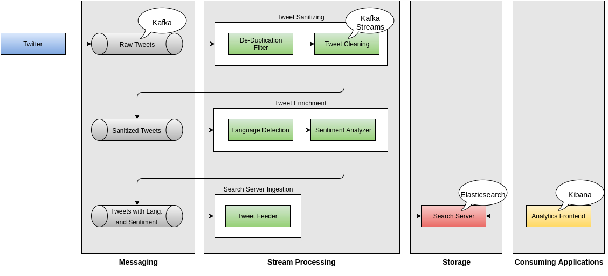

# Building a Streaming Architecture with Apache Kafka

This repository showcases how to build a streaming architecture using Apache Kafka and a variety of other tools and libraries that fit well with Kafka. 

The example application focuses around sentiment analysis and analyzes a tweet stream obtained from Twitter. Raw tweets have to be processed and enriched over multiple filters until they can be properly analyzed. Apache Kafka is at the heart of this data pipeline, connecting filters using Kafka Streams.

The following diagram shows the overall architecture of the implemented system.



## Prerequisites

Running the showcase requires a working installation of Apache ZooKeeper and Apache Kafka. We provide `Dockerfile`s for both of them to get you started easily. Please make sure that [Docker](https://docs.docker.com/engine/installation/) as well as [Docker Compose](https://docs.docker.com/compose/install/) are installed on your system.

### Versions

| Application         | Version   | Docker Image            |
| ------------------- | --------- | ----------------------- |
| Apache Kafka        | 0.10.1.1  | kafka-sampler/kafka     |
| Apache Zookeeper    | 3.4.8-1   | kafka-sampler/zookeeper |

### Building and Running the Containers

Before you execute the code samples, make sure that you have a working environment running. If you have not done it already, use the script ```docker/build-images``` to create Docker images for all required applications. After a couple of minutes, you should be ready to go.

Once the images have been successfully built, you can start the resp. containers using the provided ```docker-compose``` script. Simply issue

```bash
$ docker-compose up
```

for starting Apache Kafka, Apache Zookeeper and Yahoo Kafka Manager. Stopping the containers is best done using a separate terminal and issueing the following commands.

```bash
$ docker-compose stop
$ docker-compose rm
```

The final ```rm``` operation deletes the containers and thus clears all state so you can start over with a clean installation.

For simplicity, we restrict the Kafka cluster to a single Kafka broker. However, scaling to more Kafka brokers is easily done via `docker-compose`. You will have to provide a sensible value for `KAFKA_ADVERTISED_HOST_NAME` (other than `localhost`) for this to work, though. 

```bash
$ docker-compose scale kafka=3   # scales up to 3 Kafka brokers
$ docker-compose scale kafka=1   # scales down to 1 Kafka broker after the previous upscale
```

After changing the number of Kafka brokers, give the cluster some time so that all brokers can finish their cluster-join procedure. This should complete in a couple of seconds and you can inspect the output of the resp. Docker containers just to be sure that everything is fine. Kafka Manager should also reflect the change in the number of Kafka brokers after they successfully joined the cluster.

## On Application Architecture

### Kafka Integration

First things first: We need to integrate the Kafka Client API into our solution by providing a small `kafkasampler-kafka-adapter` that implements a couple of abstractions that we can use to get started. This Kafka Adapter provides abstractions for message encoding as well as a producer and consumer that work out of the box with these abstractions. The design goal is that an application that uses the adapter simply provides a codec that negotiates between the application-level message types and a message format that Kafka understands.

#### Message Codecs

An `Encoder` knows how to encode instances of a certain input type - call it `I` - to instances of a certain output type - call it `O`. The input type would be your application-level data type, for instances a data holder like the following `Message` class:

```java
@RequiredArgsConstructor
@Getter
class Message {
  private final UUID messageId;
  private final String messageBody;
}
```

The output type would be something that the underlying Kafka serializer is able to write to a Kafka log. Apache Kafka comes with a variety of [serializers](https://kafka.apache.org/0100/javadoc/org/apache/kafka/common/serialization/Serializer.html) (and their resp. deserializers for the inverse operation). We transform instances of class `Message` to a `String` which is written to a Kafka log using `org.apache.kafka.common.serialization.StringSerializer`.

Hence, an `Encoder` must also know which Kafka serializer is compatible with the output type `O`. We can express that easily using the following interface.

```java
import org.apache.kafka.common.serialization.Serializer;

import java.util.Optional;

public interface Encoder<I, O> {
  /**
   * Encodes the given input of type {@code I} to an output of type {@code O}.
   */
  Optional<O> encode(I input);
  
  /**
   * @return
   *   The {@link Serializer} that is compatible with the output type {@code O}
   *   of this {@code Encoder}
   */
  Class<? extends Serializer<O>> underlyingKafkaSerializer();
}
```

A `Decoder` provides the inverse operation to an `Encoder`. Hence, it actually is encoder in which input type `I` and `O` swap positions. But since Kafka uses a dedicated type for its `Deserializers`, we have to provide a dedicated interface as well.

For class `Message`, the `Decoder` would tie the underlying Kafka deserializer to `org.apache.kafka.common.serialization.StringDeserializer` and provide the means to transform the resulting `String` back to an instance of `Message`.
 
```java
import org.apache.kafka.common.serialization.Deserializer;

import java.util.Optional

public interface Decoder<I, O> {
  /**
   * Decodes the given input of type {@code I} to an output of type {@code O}.
   */
  Optional<O> decode(InputType I);
  
  /**
   * @return
   *   The {@link Deserializer} that is compatible with the input type {@code I}
   *   of this {@code Decoder}
   */
  Class<? extends Deserializer<I>> underlyingKafkaDeserializer();
}

```

Note that the input type `I` for the `Decoder` is the output type `O` of a corresponding `Encoder`.

A `Codec` ties both `Encoder` and `Decoder` together in such a way that they form a bijective mapping between their types.

```java
public interface Codec<I, O> extends Encoder<I, O>, Decoder<O, I> {
}
```

Note that the `Codec` properly swaps the positions of the input type `I` wrt. to `Encoder` and `Decoder` (same goes for output type `O`).

The idea is that applications one have to build the resp. `Codec` to write application-level data types to a Kafka log and read them back off of it. A viable solution for our example using class `Message` could be to implement a `JsonCodec<T>` (e.g. using Jackson) that implements `Codec<T, String>` and transforms instances of `Message` to the corresponding JSON string. This JSON string could be serialized using Kafka's `StringSerializer` and deserialized using `StringDeserializer`.

#### Message Processors

A `Processor` sits on the consuming side and handles application-level data types. Processing such data types may involve I/O, hence the processing logic should be decoupled from the execution of the `Consumer` that read the data off of a Kafka log that it is subscribed to. We can express the contract for a `Processor` using the following interface.

```java
import java.util.concurrent.CompletableFuture

public interface Processor<MessageType> {
  CompletableFuture<Void> process(MessageType message);
}
```

Following the example from the previous section, we would use a `Processor<Message>` to handle instances of class `Message`.

#### Producing and Consuming Kafka Messages

Classes `Producer` and `Consumer` provide wrappers around underlying Kafka producers and consumers. They can be used to commit messages to a Kafka log and consume them afterwards. Both classes have to be configured with either `ProducerSettings` or `ConsumerSettings`. These settings close over properties that are directly fed into the underlying Kafka [producer](https://kafka.apache.org/0100/documentation.html#producerconfigs) or [consumer](https://kafka.apache.org/0100/documentation.html#newconsumerconfigs) and set the contract for serializing messages by providing a `Codec` for both `Producer` and `Consumer`.

The integration test `ProduceAndConsumeMessageIT` in module `kafkasampler-it` shows how to use a producer and a consumer that share the same `Codec`.

## License
 
 This software is released under the terms of the GPL.
